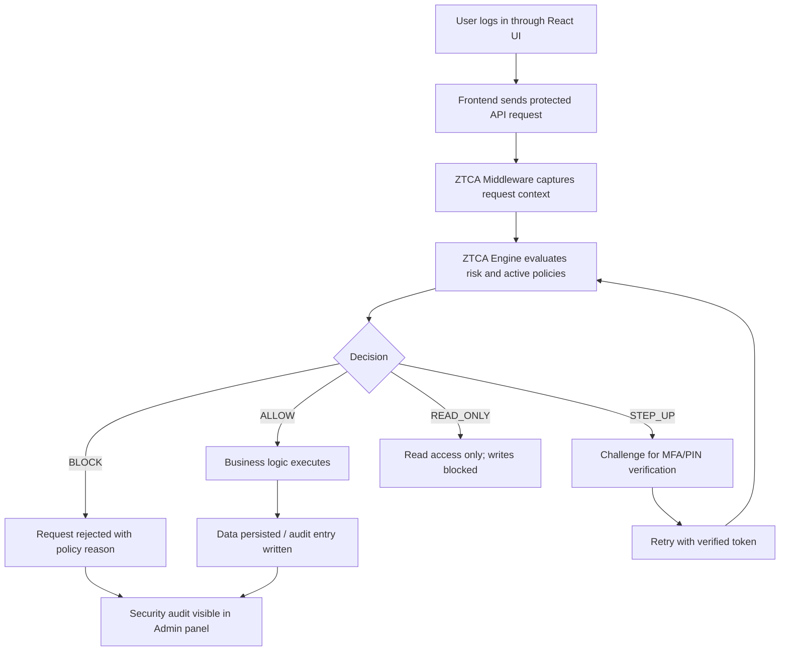

# TransitOps: A Full-Stack Fleet Operations Platform with Zero Trust Continuous Authorization

## Abstract

TransitOps is a full-stack fleet operations platform designed to demonstrate how modern transportation systems can be secured using a combination of role-based access control (RBAC), middleware-driven authorization, and Zero Trust Continuous Authorization (ZTCA). The platform integrates a React + Vite frontend, an Express + TypeScript backend, repository-backed JSON persistence, and a dedicated ZTCA middleware layer that evaluates identity, device trust, location context, timing signals, endpoint sensitivity, and required privileges for every protected request.

The system supports fleet management, vehicle tracking, driver registration, maintenance workflows, expense and fuel logging, dashboard analytics, reporting, and security administration. It implements seven active Zero Trust policies, including admin lockdown, least-privilege role enforcement, session revocation handling, sensitive-write protection, financial read-only downgrade, step-up verification, and critical-risk blocking. The platform is also designed to be explainable to end users through a trust center, audit logs, and concrete test scenarios that show how the system behaves under both normal and risky conditions.

## 1. Introduction

Modern fleet operations require not only efficient coordination of vehicles, drivers, maintenance, and finance, but also robust security controls that protect sensitive operational data. Existing systems often rely on static login checks and role assumptions that do not continuously verify the request context. TransitOps addresses this limitation by combining a conventional full-stack application with a Zero Trust middleware layer that continuously re-evaluates access decisions.

The proposed system provides a realistic operational environment for fleet management while emphasizing security as a first-class requirement. It demonstrates how a frontend application can remain user-friendly while the backend and middleware enforce granular access control, context-aware risk scoring, and session integrity checks.

## 2. System Overview

TransitOps is organized into the following layers:

1. Frontend Layer
   - React + Vite application
   - Role-aware dashboards and management interfaces
   - Trust Center and Admin security views

2. Application Layer
   - Express + TypeScript backend
   - REST-style APIs for fleet, driver, trip, maintenance, fuel, expense, and audit operations
   - Repository-backed JSON persistence for data storage

3. Middleware / Authorization Layer
   - ZTCA middleware intercepts API requests
   - It captures user identity, device fingerprint, location, timing, endpoint, method, and action metadata
   - It evaluates access through the ZTCA engine before business logic executes

4. Data and Audit Layer
   - JSON repositories for users, vehicles, drivers, trips, maintenance, fuel logs, expenses, notifications, and activity logs
   - Persistent audit records for every access decision and policy outcome

## 3. Full-Stack + Middleware Architecture

The system follows a typical full-stack architecture while emphasizing middleware-based security enforcement.

### 3.1 Frontend

The frontend provides the operational experience for fleet administrators, drivers, finance users, and safety personnel. It includes:

- Dashboard views and fleet utilization metrics
- Driver registry and compliance dashboards
- Vehicle management workflows
- Maintenance ticketing and activity tracking
- Expense and fuel ledgers
- Reports and trust policy overview
- Admin security controls for audit monitoring and policy visibility

### 3.2 Backend

The Express backend exposes a set of protected routes for:

- Authentication and registration
- Vehicle management
- Driver management
- Trip dispatch and updates
- Maintenance records
- Fuel and expense logging
- Notifications and audit retrieval

The backend is implemented in TypeScript and uses repository classes to manage persistent data in JSON files. This design makes the platform easy to run locally, inspect, and extend for demonstration or teaching purposes.

### 3.3 Middleware

The ZTCA middleware is the key innovation in this platform. It operates between the incoming frontend requests and the backend route handlers. For every protected API request, it extracts request context and builds a ZTCA request context object containing:

- user identity
- role
- device details
- known-device status
- location information
- known-location status
- odd-hours flag
- endpoint and action name
- required privilege
- session revocation state

The middleware then evaluates the request using the ZTCA engine and produces an ALLOW, STEP_UP, READ_ONLY, or BLOCK decision.

## 4. Zero Trust Continuous Authorization Model

TransitOps implements Zero Trust Continuous Authorization in a lightweight but practical form. Instead of relying only on initial authentication, every protected request is re-evaluated based on the current context.

### 4.1 Risk Detection

The ZTCA engine calculates risk using multiple signals:

- Unknown device fingerprint
- Geographic location anomaly
- Odd-hour access attempts
- Sensitive write operations such as trip dispatch, fleet changes, financial writes, or admin access
- Role privilege mismatch

A verified Step-Up token can reduce the risk score after successful MFA or PIN validation. The risk score is capped between 0 and 100, and the score is then mapped into LOW, MEDIUM, HIGH, or CRITICAL bands.

### 4.2 Role-Based Access Control (RBAC)

TransitOps implements a least-privilege role matrix that maps each user role to the privileges it may exercise. The policy matrix includes:

- Admin: manages policy, audit, and admin controls
- Fleet Manager: manages vehicles, drivers, and dispatch operations
- Driver: limited to operational updates and read access
- Safety Officer: reviews safety, maintenance, and compliance data
- Financial Analyst: manages expense visibility and ledger operations

This allows the platform to enforce both user role boundaries and request-level authorization rules.

## 5. Implemented Zero Trust Policies

The current platform implements seven live policies, all reflected in the Trust Center and enforced by the backend engine.

1. Admin Area Lockdown
   - Restricts access to admin routes and policy controls to Admin users only.

2. Dispatch Step-Up
   - Requires stronger verification when trip operations present elevated risk.

3. Fleet Record Protection
   - Protects vehicle and driver write operations using trusted device and context checks.

4. Financial Read-Only Downgrade
   - Prevents high-risk expense writes while allowing read-only inspection.

5. Universal Critical-Risk Cap
   - Blocks any request scoring at critical risk before it reaches protected resources.

6. Least-Privilege Role Matrix
   - Enforces privilege boundaries per role for every protected request.

7. Continuous Session Revocation
   - Honors session revocation headers and blocks revoked sessions immediately.

## 6. User-Visible Flow and Request Processing

### Operational Flow

1. A user authenticates into the full-stack application.
2. The frontend sends a protected request to the backend.
3. The middleware constructs a ZTCA context from headers and request metadata.
4. The engine computes risk and evaluates the policy matrix.
5. The system returns one of four decisions: ALLOW, STEP_UP, READ_ONLY, or BLOCK.
6. Successful operations are persisted, and every result is written to the audit trail.

## 7. Key Features

- Full-stack fleet management interface
- Middleware-based continuous authorization
- Role-based access control and least-privilege enforcement
- Real-time risk scoring
- Admin Trust Center for policy visibility
- Persistent audit records for review and demonstration
- User-friendly experience with clear policy explanations

## 8. User-Facing Test Cases

The application includes demonstration scenarios that show how the system behaves under both expected and risky conditions.

### 8.1 Fleet Manager Adds a Driver

A Fleet Manager can register a new driver through the UI. The backend creates both:

- a Driver profile record, and
- a login-capable user account so the driver can sign in.

### 8.2 Admin Adds Non-Driver Roles

Admin can add Fleet Managers, Safety Officers, Financial Analysts, and other supported roles. The public registration flow prevents Driver self-registration because drivers are added only through the Fleet Manager workflow.

### 8.3 Driver Cannot Add Vehicles

A Driver request to create or edit vehicles is rejected by the middleware and backend policy matrix because the requested action exceeds the Driver role’s permitted privileges.

### 8.4 Unknown Device or Location

If a request originates from an untrusted device or an unrecognized location, the risk engine increases the score. Depending on policy, the request may require Step-Up verification or be blocked.

### 8.5 Session Revocation

If a session is marked revoked, the middleware immediately blocks all subsequent protected requests, even when the user is otherwise authenticated.

### 8.6 High-Risk Financial Write

Expense-related or sensitive write operations can be downgraded to READ_ONLY when the request context becomes risky, protecting the ledger even when visibility remains allowed.

### 8.7 Critical-Risk Traffic Block

Requests with a risk score of 75 or above are blocked, preventing severe compromise signals from reaching protected APIs.

## 9. Discussion

TransitOps is intentionally designed as a teaching and demonstration platform rather than a production-grade enterprise system. It shows how a practical application can combine frontend usability, backend business logic, and security middleware into one coherent architecture. The middleware layer is essential because it provides a reusable enforcement point for identity, context, and policy evaluation.

The project also illustrates a major principle of Zero Trust design: trust must be earned continuously, not assumed at login time. This model is especially relevant in fleet, logistics, and operations systems where high-value assets, route changes, expense handling, and audit integrity are all interconnected.

## 10. Conclusion

This paper presents TransitOps as a full-stack fleet operations application enhanced with Zero Trust Continuous Authorization. The platform demonstrates that middleware-driven authorization can be integrated into a realistic operational system to improve security without sacrificing usability. Through role-based access control, contextual risk scoring, session revocation handling, and a visible audit trail, TransitOps provides a clear reference implementation for secure fleet operations in a modern web environment.

## 11. Keywords

Fleet Operations, Zero Trust, RBAC, Middleware Security, Risk Detection, Continuous Authorization, Transportation Systems, Full-Stack Web Application
